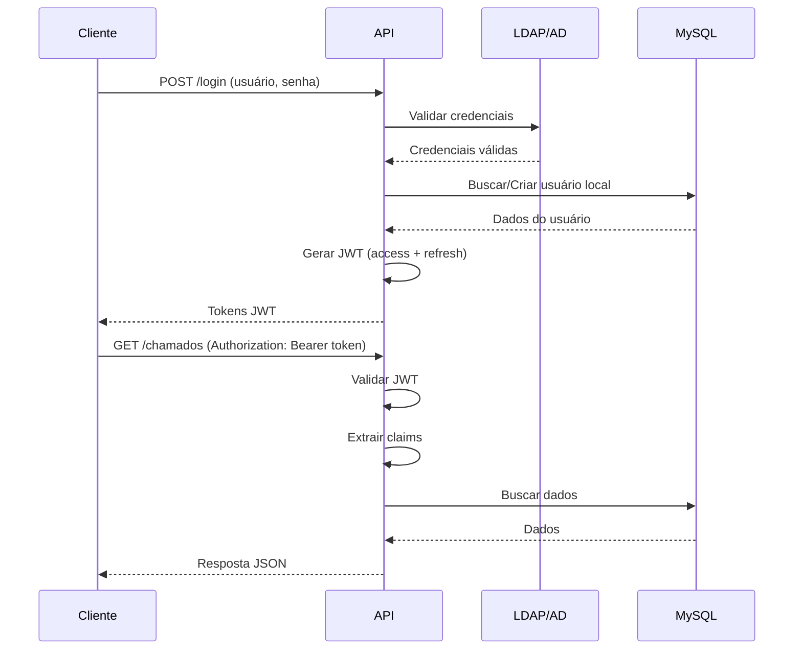

# Gestor de Chamados - Backend API


Sistema de gestão de chamados técnicos desenvolvido para a SMUL-SP, permitindo que funcionários abram solicitações de suporte e que a equipe técnica gerencie e resolva essas demandas de forma organizada e eficiente.

---

## 📋 Índice

- [Sobre o Projeto](#-sobre-o-projeto)
- [Arquitetura e Tecnologias](#-arquitetura-e-tecnologias)
- [Pré-requisitos](#-pré-requisitos)
- [Instalação e Configuração](#-instalação-e-configuração)
- [Como Usar](#-como-usar)
- [Documentação da API](#-documentação-da-api)
- [Estrutura do Projeto](#-estrutura-do-projeto)
- [Autenticação e Autorização](#-autenticação-e-autorização)
- [Comandos CLI](#-comandos-cli)
- [Docker](#-docker)
- [Variáveis de Ambiente](#-variáveis-de-ambiente)

---

## 🎯 Sobre o Projeto

O **Gestor de Chamados** é uma API REST desenvolvida para gerenciar o ciclo completo de atendimento de chamados técnicos, desde a abertura até o fechamento. O sistema atende dois públicos principais:

- **Funcionários**: Podem abrir chamados, acompanhar o status e interagir com técnicos através de comentários.
- **Equipe de Suporte Técnico**: Pode visualizar, atribuir, resolver e fechar chamados, além de gerenciar categorias e permissões.

### Principais Funcionalidades

- ✅ Abertura e gerenciamento de chamados
- ✅ Sistema de categorias e subcategorias
- ✅ Atribuição de técnicos a chamados
- ✅ Acompanhamento através de comentários
- ✅ Controle de permissões por categoria
- ✅ Autenticação via LDAP/Active Directory
- ✅ Sistema de logs para auditoria
- ✅ API REST com documentação Swagger
- ✅ Paginação e filtros avançados

---

## 🏗️ Arquitetura e Tecnologias

O projeto segue os princípios de **Clean Architecture** e **Arquitetura Hexagonal**, com forte aderência aos padrões **DDD**, **SOLID** e **Clean Code**.

### Stack Tecnológica

| Tecnologia | Versão | Uso |
|------------|--------|-----|
| **Go** | 1.25.0 | Linguagem principal (stdlib) |
| **MySQL** | 8.0 | Banco de dados relacional |
| **JWT** | v5 | Autenticação e autorização |
| **LDAP** | v3 | Integração com Active Directory |
| **Swagger** | v2.0 | Documentação da API |

### Dependências Principais

```go
github.com/go-ldap/ldap/v3 v3.4.11
github.com/go-sql-driver/mysql v1.8.0
github.com/golang-jwt/jwt/v5 v5.3.0
github.com/joho/godotenv v1.5.1
github.com/swaggo/http-swagger v1.3.4
github.com/swaggo/swag v1.16.6
```

### Camadas da Arquitetura

```
┌─────────────────────────────────────────┐
│           cmd/api (Bootstrap)           │
├─────────────────────────────────────────┤
│      internal/http (Handlers)           │
│      internal/http/router               │
│      internal/http/middleware           │
├─────────────────────────────────────────┤
│      internal/service (Casos de Uso)    │
├─────────────────────────────────────────┤
│      internal/domain (Entidades)        │
│      - chamado, usuario, categoria      │
│      - atendimento, acompanhamento      │
├─────────────────────────────────────────┤
│      internal/infra (Infraestrutura)    │
│      - mysql (Repositórios)             │
│      - container (DI)                   │
│      - migrations                       │
└─────────────────────────────────────────┘
```

**Princípios Aplicados:**
- **Inversão de Dependências**: Camadas superiores dependem de abstrações, não de implementações
- **Injeção de Dependências Explícita**: Container gerencia todas as dependências
- **Separação de Responsabilidades**: Cada camada tem uma única responsabilidade
- **Padrão Repository**: Abstração da camada de persistência
- **Domain-Driven Design**: Entidades ricas em comportamento e validação

---

## 📦 Pré-requisitos

Antes de começar, certifique-se de ter instalado:

- **Go** 1.25.0 ou superior ([Download](https://go.dev/dl/))
- **MySQL** 8.0 ([Download](https://dev.mysql.com/downloads/mysql/))
- **Docker** e **Docker Compose** (opcional, para ambiente de desenvolvimento) ([Download](https://docs.docker.com/get-docker/))
- **Git** ([Download](https://git-scm.com/downloads))

---

## 🚀 Instalação e Configuração

### 1. Clone o Repositório

```bash
git clone https://github.com/smdu-sp/gestor-de-chamados-backend-Go.git
cd gestor-de-chamados-backend-Go
```

### 2. Instale as Dependências

```bash
go mod download
```

### 3. Configure as Variáveis de Ambiente

Crie um arquivo `.env` na raiz do projeto baseado no exemplo abaixo:

```bash
cp .env.example .env
```

Edite o arquivo `.env` com suas configurações:

```env
# APP
APP_NAME=GestorDeChamadosAPI
VERSION=1.0.0
LOG_LEVEL=INFO
ENVIRONMENT=development
PORT=8080
CORS_ORIGIN=http://localhost:3000

# SERVER
SERVER_READ_TIMEOUT=15s
SERVER_WRITE_TIMEOUT=15s
SERVER_IDLE_TIMEOUT=60s
SERVER_SHUTDOWN_TIMEOUT=10s

# DATABASE
DB_HOST=localhost
DB_PORT=3306
DB_USER=user
DB_PASS=userpassword
DB_NAME=mydatabase
DB_MAX_OPEN_CONNS=25
DB_MAX_IDLE_CONNS=10
DB_CONN_MAX_LIFETIME=30m
DB_CONN_MAX_IDLE_TIME=5m
DB_MIGRATION_TIMEOUT=2m

# JWT
TOKEN_SECRET=sua-chave-secreta-muito-segura
REFRESH_TOKEN_SECRET=sua-chave-refresh-muito-segura
TOKEN_TTL=24h
REFRESH_TOKEN_TTL=168h

# LDAP (Active Directory)
LDAP_SERVER=ldap://seu-servidor:389
LDAP_DOMAIN=seu-dominio
LDAP_BASE=DC=seu,DC=dominio
LDAP_USER=usuario-bind
LDAP_PASS=senha-bind
LDAP_LOGIN_ATTR=sAMAccountName
```

### 4. Inicie o Banco de Dados

#### Opção A: Usando Docker Compose (Recomendado para Desenvolvimento)

```bash
docker-compose up -d
```

Isso iniciará:
- MySQL 8.0 na porta 3306
- OpenLDAP (para testes) na porta 389

#### Opção B: MySQL Local

Certifique-se de que o MySQL está rodando e crie o banco de dados:

```sql
CREATE DATABASE mydatabase CHARACTER SET utf8mb4 COLLATE utf8mb4_unicode_ci;
CREATE USER 'user'@'localhost' IDENTIFIED BY 'userpassword';
GRANT ALL PRIVILEGES ON mydatabase.* TO 'user'@'localhost';
FLUSH PRIVILEGES;
```

### 5. Execute as Migrations

```bash
go run ./cmd/api migrate
```

Saída esperada:
```
╔══════════════════════════════════════════╗
║   GESTOR DE CHAMADOS API - v1.25.0       ║
╚══════════════════════════════════════════╝
INFO: EXECUTANDO MIGRATIONS
INFO: MIGRATIONS EXECUTADAS COM SUCESSO
```

### 6. (Opcional) Popule o Banco com Dados de Teste

⚠️ **ATENÇÃO**: Execute este comando **APENAS EM DESENVOLVIMENTO**!

```bash
go run ./cmd/api seed
```

Dados criados:
- 4 usuários de teste (admin, técnico, usuário comum, desenvolvedor)
- 2 categorias (Infraestrutura, Software)
- 4 subcategorias
- 2 chamados de exemplo
- Permissões e logs de exemplo

**Usuários padrão** (senha via LDAP):
| Login | Permissão | Descrição |
|-------|-----------|-----------|
| `admin` | ADM | Administrador do sistema |
| `joao.tec` | TEC | Técnico de suporte |
| `maria.usr` | USR | Usuário comum |
| `carlos.dev` | DEV | Desenvolvedor |

---

## 🎯 Como Usar

### Iniciando o Servidor

```bash
go run ./cmd/api server
```

Saída esperada:
```
╔══════════════════════════════════════════╗
║   GESTOR DE CHAMADOS API - v1.25.0       ║
╚══════════════════════════════════════════╝
INFO: INICIANDO SERVIDOR
INFO: Servidor HTTP iniciado na porta :8080
```

### Acessando a API

A API estará disponível em:
- **Base URL**: `http://localhost:8080`
- **Documentação Swagger**: `http://localhost:8080/swagger/index.html`
- **Health Check**: `http://localhost:8080/health`

### Testando a API

#### 1. Health Check

```bash
curl http://localhost:8080/health
```

Resposta:
```json
{
  "status": "ok",
  "timestamp": "2025-01-13T10:00:00Z"
}
```

#### 2. Login

```bash
curl -X POST http://localhost:8080/login \
  -H "Content-Type: application/json" \
  -d '{
    "login": "admin",
    "senha": "sua-senha-ldap"
  }'
```

Resposta:
```json
{
  "accessToken": "eyJhbGciOiJIUzI1NiIsInR5cCI6IkpXVCJ9...",
  "refreshToken": "eyJhbGciOiJIUzI1NiIsInR5cCI6IkpXVCJ9..."
}
```

#### 3. Listar Chamados (com autenticação)

```bash
curl http://localhost:8080/chamados/listar-paginado \
  -H "Authorization: Bearer SEU_ACCESS_TOKEN"
```

---

## 📚 Documentação da API

### Swagger UI

A documentação completa da API está disponível em:

```
http://localhost:8080/swagger/index.html
```

### Principais Endpoints

#### Autenticação
- `POST /login` - Autenticar usuário
- `POST /refresh` - Renovar tokens
- `GET /me` - Dados do usuário autenticado

#### Chamados
- `POST /chamados` - Criar novo chamado
- `GET /chamados/buscar/{id}` - Buscar chamado por ID
- `GET /chamados/listar-paginado` - Listar com paginação e filtros
- `PATCH /chamados/atualizar/{id}` - Atualizar chamado
- `PATCH /chamados/atualizar-status/{id}` - Atualizar status
- `PATCH /chamados/atualizar-solucao/{id}` - Adicionar solução
- `DELETE /chamados/arquivar/{id}` - Arquivar chamado

#### Usuários
- `POST /usuarios` - Criar usuário
- `GET /usuarios/buscar-por-id/{id}` - Buscar usuário
- `GET /usuarios/listar-paginado` - Listar com paginação
- `PATCH /usuarios/atualizar/{id}` - Atualizar usuário
- `PATCH /usuarios/atualizar-permissao/{id}` - Alterar permissão

#### Categorias e Subcategorias
- `POST /categorias` - Criar categoria
- `GET /categorias/listar-paginado` - Listar categorias
- `POST /subcategorias` - Criar subcategoria
- `GET /subcategorias/listar-paginado` - Listar subcategorias

#### Atendimentos
- `POST /atendimentos` - Atribuir técnico a chamado
- `GET /atendimentos/listar-paginado` - Listar atendimentos

#### Acompanhamentos
- `POST /acompanhamentos` - Adicionar comentário
- `GET /acompanhamentos/buscar-por-chamado/{id}` - Listar por chamado

#### Logs
- `GET /logs/listar-paginado` - Listar logs de auditoria

### Paginação e Filtros

Todos os endpoints de listagem suportam paginação:

```
GET /chamados/listar-paginado?pagina=1&limite=10&status=ABERTO&categoriaId=abc123
```

Parâmetros comuns:
- `pagina`: Número da página (padrão: 1)
- `limite`: Itens por página (padrão: 10)
- `busca`: Termo de busca textual
- Filtros específicos por entidade

---

## 📁 Estrutura do Projeto

```
gestor-de-chamados-backend-Go/
├── cmd/
│   └── api/                    # Ponto de entrada da aplicação
│       ├── main.go             # Bootstrap e CLI
│       ├── comandos.go         # Comandos migrate, server, seed
│       └── servidor.go         # Inicialização do servidor HTTP
│
├── internal/
│   ├── auth/                   # Autenticação e autorização
│   │   ├── auth.go             # Serviço de autenticação interna
│   │   ├── jwt.go              # Geração e validação de JWT
│   │   ├── ldap.go             # Integração com LDAP/AD
│   │   ├── dto.go              # DTOs de autenticação
│   │   └── handler.go          # Handlers HTTP de auth
│   │
│   ├── banner/                 # Banner ASCII da aplicação
│   │   ├── banner.go
│   │   └── banner.txt
│   │
│   ├── config/                 # Configuração centralizada
│   │   ├── config.go           # Carregamento de configs
│   │   ├── app.go              # Configurações da aplicação
│   │   ├── server.go           # Configurações do servidor
│   │   ├── database.go         # Configurações do banco
│   │   ├── auth.go             # Configurações de JWT
│   │   ├── ldap.go             # Configurações de LDAP
│   │   └── erros.go            # Tratamento de erros de config
│   │
│   ├── domain/                 # Camada de domínio (entidades)
│   │   ├── acompanhamento/     # Entidade Acompanhamento
│   │   ├── atendimento/        # Entidade Atendimento
│   │   ├── categoria/          # Entidade Categoria
│   │   ├── categoria_permissao/# Entidade Categoria Permissão
│   │   ├── chamado/            # Entidade Chamado
│   │   ├── log/                # Entidade Log
│   │   ├── subcategoria/       # Entidade Subcategoria
│   │   ├── usuario/            # Entidade Usuario
│   │   ├── erros.go            # Erros de validação do domínio
│   │   ├── paginacao.go        # Estrutura de paginação
│   │   └── id.go               # Interface GeradorID
│   │
│   ├── http/                   # Camada HTTP
│   |   ├── dto/                # Data Transfer Objects
│   |   │   ├── acompanhamento.go
│   |   │   ├── atendimento.go
│   |   │   ├── categoria.go
│   |   │   ├── categoria_permissao.go
│   |   │   ├── chamado.go
│   |   │   ├── log.go
│   |   │   ├── subcategoria.go
│   |   │   ├── usuario.go
│   |   │   ├── map.go          # Helpers de mapeamento
│   |   │   └── paginacao.go    # DTO de resposta paginada
|   |   |
│   │   ├── handler/            # Handlers por entidade
│   │   │   ├── acompanhamento.go
│   │   │   ├── atendimento.go
│   │   │   ├── categoria.go
│   │   │   ├── categoria_permissao.go
│   │   │   ├── chamado.go
│   │   │   ├── log.go
│   │   │   ├── subcategoria.go
│   │   │   ├── usuario.go
│   │   │   ├── erros.go        # Tratamento de erros HTTP
│   │   │   └── helpers.go      # Utilitários HTTP
│   │   │
│   │   ├── middleware/         # Middlewares HTTP
│   │   │   ├── cors.go
│   │   │   └── recovery.go
│   │   │
│   │   └── router/             # Configuração de rotas
│   │       ├── router.go
│   │       └── [entidades].go  # Rotas por entidade
│   │
│   ├── infra/                  # Camada de infraestrutura
│   │   ├── container/          # Injeção de dependências
│   │   │   ├── container.go
│   │   │   ├── handlers.go
│   │   │   ├── repositories.go
│   │   │   └── services.go
│   │   │
│   │   ├── id/                 # Geração de IDs (UUIDv7)
│   │   │   ├── generator.go
│   │   │   └── uuidv7.go
│   │   │
│   │   ├── migrations/         # Migrations do banco
│   │   │   ├── migrator.go
│   │   │   └── mysql.go
│   │   │
│   │   └── mysql/              # Repositórios MySQL
│   │       ├── mysql.go        # Conexão e configuração
│   │       ├── rows.go         # Helpers de scan
│   │       ├── seed.go         # Dados iniciais
│   │       └── [entidades].go  # Repositórios por entidade
│   │
│   └── service/                # Camada de serviços (casos de uso)
│       ├── acompanhamento.go
│       ├── atendimento.go
│       ├── categoria.go
│       ├── categoria_permissao.go
│       ├── chamado.go
│       ├── log.go
│       ├── subcategoria.go
│       └── usuario.go
│
├── deploy/                     # Scripts de deployment
├── docs/                       # Documentação adicional
├── infra/                      # Infraestrutura (Docker, K8s)
│   ├── id/                     # Migrations SQL
│   └── migrations/
│       └── mysql/
│           └── seed.sql
│
├── pkg/                        # Pacotes públicos reutilizáveis
├── scripts/                    # Scripts auxiliares
├── tests/                      # Testes (futuros)
│
├── .env.example                # Exemplo de variáveis de ambiente
├── .gitignore
├── docker-compose.yml          # Docker Compose para dev
├── go.mod
├── go.sum
├── Makefile                    # Comandos make (futuro)
└── README.md                   # Este arquivo
```

### Organização por Camada

**1. Domain (`internal/domain/`):**
- Entidades puras com validações de negócio
- Independente de frameworks e infraestrutura
- Define interfaces de repositórios

**2. Service (`internal/service/`):**
- Casos de uso e orquestração de regras de negócio
- Coordena múltiplas entidades
- Depende apenas de interfaces do domínio

**3. Infrastructure (`internal/infra/`):**
- Implementações concretas de repositórios
- Conexão com banco de dados
- Migrations e geração de IDs

**4. HTTP (`internal/http/`):**
- Handlers, routers e middlewares
- Tradução entre HTTP e domínio via DTOs
- Não contém regras de negócio

**5. Auth (`internal/auth/`):**
- Autenticação JWT e LDAP
- Autorização baseada em permissões
- Claims e contexto de usuário autenticado

---

## 🔐 Autenticação e Autorização

### Sistema de Permissões

O sistema possui 4 níveis de permissão:

| Permissão | Sigla | Descrição | Acesso |
|-----------|-------|-----------|--------|
| Administrador | `ADM` | Acesso total ao sistema | Gerenciar usuários, categorias, permissões |
| Técnico | `TEC` | Atende e resolve chamados | Ver e atribuir chamados das suas categorias |
| Usuário | `USR` | Abre e acompanha chamados | Criar chamados, ver próprios chamados |
| Desenvolvedor | `DEV` | Desenvolvedor do sistema | Acesso técnico ao sistema |

### Controle de Acesso por Rota

Todas as rotas protegidas verificam automaticamente as permissões do usuário através do middleware de autorização. Abaixo está o mapeamento completo de permissões:

#### 🔓 Rotas Públicas (Sem Autenticação)

| Método | Endpoint | Descrição |
|--------|----------|-----------|
| `POST` | `/login` | Login de usuário |
| `POST` | `/refresh` | Renovar tokens JWT |
| `GET` | `/health` | Health check do servidor |
| `GET` | `/swagger/*` | Documentação Swagger |

#### 🔒 Autenticação

| Método | Endpoint | Permissões | Descrição |
|--------|----------|------------|-----------|
| `GET` | `/eu` | **Qualquer autenticado** | Dados do usuário logado |

#### 👥 Usuários

| Método | Endpoint | Permissões | Descrição |
|--------|----------|------------|-----------|
| `POST` | `/usuarios` | `ADM`, `DEV` | Criar usuário |
| `GET` | `/usuarios/listar-paginado` | `ADM`, `DEV` | Listar usuários |
| `GET` | `/usuarios/listar` | `ADM`, `DEV` | Listar todos os usuários |
| `GET` | `/usuarios/buscar-por-id/{id}` | `ADM`, `DEV` | Buscar usuário por ID |
| `GET` | `/usuarios/buscar-novo/{login}` | `ADM`, `DEV` | Buscar usuário no LDAP |
| `GET` | `/usuarios/buscar-tecnicos` | `ADM`, `DEV` | Listar técnicos |
| `PATCH` | `/usuarios/atualizar/{id}` | `ADM`, `DEV` | Atualizar usuário |
| `PATCH` | `/usuarios/atualizar-permissao/{id}` | `ADM`, `DEV` | Alterar permissão |
| `PATCH` | `/usuarios/ativar/{id}` | `ADM`, `DEV` | Ativar usuário |
| `PATCH` | `/usuarios/autorizar/{id}` | `ADM`, `DEV` | Autorizar usuário |
| `DELETE` | `/usuarios/desativar/{id}` | `ADM`, `DEV` | Desativar usuário |
| `GET` | `/usuarios/validar-usuario` | **Qualquer autenticado** | Validar usuário logado |

#### 📋 Chamados

| Método | Endpoint | Permissões | Descrição |
|--------|----------|------------|-----------|
| `POST` | `/chamados` | `ADM`, `TEC`, `USR`, `DEV` | Criar chamado |
| `GET` | `/chamados/listar-paginado` | `ADM`, `TEC`, `USR`, `DEV` | Listar chamados |
| `GET` | `/chamados/listar` | `ADM`, `TEC`, `USR`, `DEV` | Listar todos |
| `GET` | `/chamados/buscar-por-id/{id}` | `ADM`, `TEC`, `USR`, `DEV` | Buscar por ID |
| `PATCH` | `/chamados/atualizar/{id}` | `ADM`, `TEC`, `USR`, `DEV` | Atualizar chamado |
| `PATCH` | `/chamados/atualizar-status/{id}` | `ADM`, `TEC`, `DEV` | Atualizar status |
| `PATCH` | `/chamados/atualizar-solucao/{id}` | `ADM`, `TEC`, `DEV` | Adicionar solução |
| `PATCH` | `/chamados/arquivar/{id}` | `ADM`, `TEC`, `USR`, `DEV` | Arquivar chamado |
| `PATCH` | `/chamados/desarquivar/{id}` | `ADM`, `TEC`, `USR`, `DEV` | Desarquivar chamado |

#### 🏷️ Categorias

| Método | Endpoint | Permissões | Descrição |
|--------|----------|------------|-----------|
| `POST` | `/categorias` | `ADM`, `DEV` | Criar categoria |
| `GET` | `/categorias/listar-paginado` | `ADM`, `TEC`, `USR`, `DEV` | Listar categorias |
| `GET` | `/categorias/listar` | `ADM`, `TEC`, `USR`, `DEV` | Listar todas |
| `GET` | `/categorias/buscar-por-id/{id}` | `ADM`, `TEC`, `USR`, `DEV` | Buscar por ID |
| `GET` | `/categorias/buscar-por-nome/{nome}` | `ADM`, `TEC`, `USR`, `DEV` | Buscar por nome |
| `PATCH` | `/categorias/atualizar/{id}` | `ADM`, `DEV` | Atualizar categoria |
| `PATCH` | `/categorias/ativar/{id}` | `ADM`, `DEV` | Ativar categoria |
| `DELETE` | `/categorias/desativar/{id}` | `ADM`, `DEV` | Desativar categoria |

#### 🔖 Subcategorias

| Método | Endpoint | Permissões | Descrição |
|--------|----------|------------|-----------|
| `POST` | `/subcategorias` | `ADM`, `DEV` | Criar subcategoria |
| `GET` | `/subcategorias/listar-paginado` | `ADM`, `TEC`, `USR`, `DEV` | Listar subcategorias |
| `GET` | `/subcategorias/listar` | `ADM`, `TEC`, `USR`, `DEV` | Listar todas |
| `GET` | `/subcategorias/buscar-por-id/{id}` | `ADM`, `TEC`, `USR`, `DEV` | Buscar por ID |
| `PATCH` | `/subcategorias/atualizar/{id}` | `ADM`, `DEV` | Atualizar subcategoria |
| `PATCH` | `/subcategorias/ativar/{id}` | `ADM`, `DEV` | Ativar subcategoria |
| `DELETE` | `/subcategorias/desativar/{id}` | `ADM`, `DEV` | Desativar subcategoria |

#### 👨‍💼 Atendimentos

| Método | Endpoint | Permissões | Descrição |
|--------|----------|------------|-----------|
| `POST` | `/atendimentos` | `ADM`, `TEC`, `DEV` | Atribuir técnico |
| `GET` | `/atendimentos/listar-paginado` | `ADM`, `TEC`, `DEV` | Listar atendimentos |
| `GET` | `/atendimentos/buscar-por-id/{id}` | `ADM`, `TEC`, `DEV` | Buscar por ID |
| `GET` | `/atendimentos/buscar-por-ids/chamados/{chamadoId}/tecnicos/{tecnicoId}` | `ADM`, `TEC`, `DEV` | Buscar por chamado e técnico |
| `PATCH` | `/atendimentos/atualizar/{id}` | `ADM`, `TEC`, `DEV` | Atualizar atendimento |

#### 💬 Acompanhamentos

| Método | Endpoint | Permissões | Descrição |
|--------|----------|------------|-----------|
| `POST` | `/acompanhamentos` | `ADM`, `TEC`, `USR`, `DEV` | Criar comentário |
| `GET` | `/acompanhamentos/listar-paginado` | `ADM`, `TEC`, `USR`, `DEV` | Listar comentários |
| `GET` | `/acompanhamentos/buscar-por-id/{id}` | `ADM`, `TEC`, `USR`, `DEV` | Buscar por ID |
| `GET` | `/acompanhamentos/buscar-por-chamado-id/{id}` | `ADM`, `TEC`, `USR`, `DEV` | Buscar por chamado |
| `PATCH` | `/acompanhamentos/atualizar/{id}` | `ADM`, `TEC`, `USR`, `DEV` | Atualizar comentário |
| `DELETE` | `/acompanhamentos/deletar/{id}` | `ADM`, `TEC`, `USR`, `DEV` | Deletar comentário |

#### 🔑 Categoria Permissões

| Método | Endpoint | Permissões | Descrição |
|--------|----------|------------|-----------|
| `POST` | `/categoria-permissoes/criar` | `ADM`, `DEV` | Criar permissão |
| `GET` | `/categoria-permissoes/listar-paginado` | `ADM`, `TEC`, `DEV` | Listar permissões |
| `GET` | `/categorias-permissoes/{categoriaId}/usuarios/{usuarioId}` | `ADM`, `TEC`, `USR`, `DEV` | Buscar permissão |
| `PATCH` | `/categorias-permissoes/atualizar/{categoriaId}/usuarios/{usuarioId}` | `ADM`, `DEV` | Atualizar permissão |
| `DELETE` | `/categorias-permissoes/deletar/{categoriaId}/usuarios/{usuarioId}` | `ADM`, `DEV` | Deletar permissão |

#### 📊 Logs (Auditoria)

| Método | Endpoint | Permissões | Descrição |
|--------|----------|------------|-----------|
| `GET` | `/logs/listar-paginado` | `DEV` | Listar logs |
| `GET` | `/logs/buscar-por-id/{id}` | `DEV` | Buscar log por ID |

### Resumo de Permissões por Funcionalidade

| Funcionalidade | ADM | TEC | USR | DEV |
|----------------|:---:|:---:|:---:|:---:|
| **Criar/Gerenciar Usuários** | ✅ | ❌ | ❌ | ✅ |
| **Criar Chamados** | ✅ | ✅ | ✅ | ✅ |
| **Visualizar Chamados** | ✅ | ✅ | ✅ | ✅ |
| **Atualizar Status/Solução** | ✅ | ✅ | ❌ | ✅ |
| **Atribuir Técnicos** | ✅ | ✅ | ❌ | ✅ |
| **Comentar Chamados** | ✅ | ✅ | ✅ | ✅ |
| **Gerenciar Categorias** | ✅ | ❌ | ❌ | ✅ |
| **Ver Categorias** | ✅ | ✅ | ✅ | ✅ |
| **Gerenciar Permissões** | ✅ | ❌ | ❌ | ✅ |
| **Ver Logs de Auditoria** | ❌ | ❌ | ❌ | ✅ |

### Fluxo de Autenticação



### Tokens JWT

**Access Token:**
- Validade: 24h (configurável)
- Usado em todas as requisições
- Contém: ID, login, nome, email, permissão

**Refresh Token:**
- Validade: 7 dias (configurável)
- Usado apenas para renovar tokens
- Não deve ser usado em requisições normais

### Exemplo de Uso

```bash
# 1. Login
TOKEN=$(curl -s -X POST http://localhost:8080/login \
  -H "Content-Type: application/json" \
  -d '{"login":"admin","senha":"sua-senha"}' \
  | jq -r '.accessToken')

# 2. Usar token em requisições
curl http://localhost:8080/chamados/listar-paginado \
  -H "Authorization: Bearer $TOKEN"

# 3. Renovar token quando expirar
REFRESH_TOKEN="seu-refresh-token"
curl -X POST http://localhost:8080/refresh \
  -H "Content-Type: application/json" \
  -d "{\"refreshToken\":\"$REFRESH_TOKEN\"}"
```

### Permissões por Categoria

Usuários podem ter permissões específicas para categorias:

```bash
# Dar permissão TEC ao usuário em uma categoria
curl -X POST http://localhost:8080/categoria-permissoes \
  -H "Authorization: Bearer $TOKEN" \
  -H "Content-Type: application/json" \
  -d '{
    "categoriaId": "abc123",
    "usuarioId": "usr456",
    "permissao": "TEC"
  }'
```

---

## 🛠️ Comandos CLI

A aplicação possui uma interface CLI para gerenciar diferentes aspectos do sistema:

### `migrate` - Executar Migrations

Aplica todas as migrations pendentes no banco de dados.

```bash
go run ./cmd/api migrate
```

**Quando usar:**
- Primeira vez configurando o banco
- Após atualizar o código com novas migrations
- Antes de iniciar o servidor em produção

**Saída esperada:**
```
╔══════════════════════════════════════════╗
║   GESTOR DE CHAMADOS API - v1.25.0       ║
╚══════════════════════════════════════════╝
INFO: EXECUTANDO MIGRATIONS
INFO: MIGRATIONS EXECUTADAS COM SUCESSO
```

### `server` - Iniciar Servidor HTTP

Inicia o servidor HTTP na porta configurada.

```bash
go run ./cmd/api server
```

**Saída esperada:**
```
╔══════════════════════════════════════════╗
║   GESTOR DE CHAMADOS API - v1.25.0       ║
╚══════════════════════════════════════════╝
INFO: INICIANDO SERVIDOR
INFO: Servidor HTTP iniciado na porta :8080
```

### `seed` - Popular Banco com Dados de Teste

⚠️ **APENAS PARA DESENVOLVIMENTO**

Popula o banco de dados com dados de exemplo.

```bash
go run ./cmd/api seed
```

**Dados criados:**
- 4 usuários (admin, técnico, usuário, dev)
- 2 categorias
- 4 subcategorias
- 2 chamados de exemplo
- Atendimentos, acompanhamentos e logs

### `help` - Exibir Ajuda

Mostra todos os comandos disponíveis.

```bash
go run ./cmd/api help
```

---

## 🐳 Docker

### Ambiente de Desenvolvimento

O projeto inclui um `docker-compose.yml` para facilitar o desenvolvimento local:

```yaml
version: "3.9"

services:
  db:
    image: mysql:8.0
    container_name: my-database
    environment:
      MYSQL_ROOT_PASSWORD: rootpassword
      MYSQL_DATABASE: mydatabase
      MYSQL_USER: user
      MYSQL_PASSWORD: userpassword
    ports:
      - "3306:3306"
    volumes:
      - db_data:/var/lib/mysql

  ldap:
    image: osixia/openldap:1.5.0
    container_name: ldap-test
    environment:
      LDAP_ORGANISATION: "Rede SP"
      LDAP_DOMAIN: "rede.sp"
      LDAP_ADMIN_PASSWORD: "Prodam0"
    ports:
      - "389:389"
```

### Comandos Docker

```bash
# Iniciar serviços
docker-compose up -d

# Ver logs
docker-compose logs -f

# Parar serviços
docker-compose down

# Parar e remover volumes (CUIDADO: apaga dados)
docker-compose down -v
```

### Conectar ao MySQL no Docker

```bash
docker exec -it my-database mysql -uuser -puserpassword mydatabase
```

### Build da Aplicação (Futuro)

Para criar uma imagem Docker da aplicação:

```bash
# Build
docker build -t gestor-chamados-api:latest .

# Run
docker run -p 8080:8080 \
  --env-file .env \
  gestor-chamados-api:latest
```

---

## 📝 Variáveis de Ambiente

### Configuração Completa

```env
#===============================================================================
# APP - Configurações Gerais
#===============================================================================

# Nome da aplicação
APP_NAME=GestorDeChamadosAPI

# Versão da aplicação
VERSION=1.0.0

# Nível de log padrão (DEBUG, INFO, WARN, ERROR)
LOG_LEVEL=INFO

# Ambiente da aplicação (development | production)
ENVIRONMENT=development

# Porta da aplicação
PORT=8080

# Origem permitida para CORS
CORS_ORIGIN=http://localhost:3000

#===============================================================================
# SERVER - Configurações do Servidor HTTP
#===============================================================================

# Tempo máximo para leitura de uma requisição
SERVER_READ_TIMEOUT=15s

# Tempo máximo para escrita de uma resposta
SERVER_WRITE_TIMEOUT=15s

# Tempo máximo de inatividade da conexão
SERVER_IDLE_TIMEOUT=60s

# Tempo máximo para desligamento gracioso do servidor
SERVER_SHUTDOWN_TIMEOUT=10s

# Tamanho do buffer do canal de sinais do servidor
SERVER_SIGNAL_CHANNEL_BUFFER_SIZE=1

# Tamanho do buffer do canal de erros do servidor
SERVER_ERROR_CHANNEL_BUFFER_SIZE=1

#===============================================================================
# DATABASE - MySQL 8.0
#===============================================================================

# Host do banco de dados
DB_HOST=localhost

# Porta do banco de dados
DB_PORT=3306

# Usuário do banco de dados
DB_USER=user

# Senha do banco de dados
DB_PASS=userpassword

# Nome do banco de dados
DB_NAME=mydatabase

# Máximo de conexões abertas
DB_MAX_OPEN_CONNS=25

# Máximo de conexões ociosas
DB_MAX_IDLE_CONNS=10

# Tempo máximo de vida de uma conexão
DB_CONN_MAX_LIFETIME=30m

# Tempo máximo de inatividade de uma conexão
DB_CONN_MAX_IDLE_TIME=5m

# Número máximo de tentativas de conexão
DB_MAX_RETRY_ATTEMPTS=5

# Tempo máximo para migrações do banco
DB_MIGRATION_TIMEOUT=2m

#===============================================================================
# JWT - Configurações de Autenticação
#===============================================================================

# Chave secreta do token JWT
TOKEN_SECRET=em-producao-troque-esta-chave-token-secreta-por-uma-muito-segura

# Chave secreta do refresh token
REFRESH_TOKEN_SECRET=em-producao-troque-esta-chave-token-refresh-secreta-por-uma-muito-segura

# Tempo de vida do token
TOKEN_TTL=24h

# Tempo de vida do refresh token
REFRESH_TOKEN_TTL=168h

#===============================================================================
# LDAP - Configurações de Diretório Ativo
#===============================================================================

#--- Active Directory (Produção) ---

# Servidor LDAP
LDAP_SERVER=ldap://seu-servidor-ad:389

# Domínio LDAP
LDAP_DOMAIN=seudominio.local

# Base DN
LDAP_BASE=DC=seudominio,DC=local

# Usuário de bind
LDAP_USER=CN=Usuario Bind,OU=ServiceAccounts,DC=seudominio,DC=local

# Senha do usuário de bind
LDAP_PASS=senha-do-usuario-bind

# Atributo de login
LDAP_LOGIN_ATTR=sAMAccountName

#--- OpenLDAP (Desenvolvimento - simulando AD no Docker) ---
# LDAP_SERVER=ldap://localhost:389
# LDAP_BASE=dc=rede,dc=sp
# LDAP_USER=cn=admin,dc=rede,dc=sp
# LDAP_PASS=Prodam0
# LDAP_LOGIN_ATTR=uid
```

### Variáveis Obrigatórias por Ambiente

#### Desenvolvimento
```env
DB_HOST=localhost
DB_PORT=3306
DB_USER=user
DB_PASS=userpassword
DB_NAME=mydatabase

TOKEN_SECRET=qualquer-chave-dev
REFRESH_TOKEN_SECRET=qualquer-chave-refresh-dev
```

#### Produção

⚠️ **IMPORTANTE**: Em produção, todas as variáveis devem ser configuradas com valores seguros!

```env
ENVIRONMENT=production

# CORS não pode ser * ou localhost
CORS_ORIGIN=https://seu-dominio-producao.com

# DB não pode ser localhost
DB_HOST=servidor-mysql-producao
DB_USER=usuario-producao
DB_PASS=senha-muito-segura-producao

# Chaves JWT devem ser únicas e complexas
TOKEN_SECRET=chave-unica-complexa-min-32-caracteres-prod
REFRESH_TOKEN_SECRET=chave-unica-complexa-min-32-caracteres-refresh-prod

# LDAP configurado com Active Directory
LDAP_SERVER=ldap://seu-ad-server:389
LDAP_DOMAIN=empresa.local
LDAP_BASE=DC=empresa,DC=local
```

### Validações Automáticas

O sistema valida automaticamente as configurações no startup:

✅ **Validações Gerais:**
- Ambiente deve ser: `local`, `development` ou `production`
- Porta deve estar entre 1 e 65535
- Nível de log deve ser válido: `DEBUG`, `INFO`, `WARN`, `ERROR`

✅ **Validações de Produção:**
- `CORS_ORIGIN` não pode ser `*`, `localhost` ou vazio
- `DB_HOST` não pode ser `localhost`
- Segredos JWT não podem ser valores default

✅ **Validações de Banco:**
- Host, porta, usuário, senha e nome do banco são obrigatórios
- Número de conexões deve ser consistente
- Timeouts devem ser positivos

✅ **Validações de JWT:**
- Segredos devem ter pelo menos 32 caracteres
- `TOKEN_TTL` máximo recomendado: 48h
- `REFRESH_TOKEN_TTL` máximo recomendado: 30 dias

---

## 🧪 Status do Chamado

O sistema gerencia chamados através de 5 status principais:

```
┌─────────┐
│ ABERTO  │ ◄── Chamado criado pelo usuário
└────┬────┘
     │
     ▼
┌────────────┐
│ ATRIBUIDO  │ ◄── Técnico foi designado
└─────┬──────┘
      │
      ├─────────┐
      ▼         ▼
┌───────────┐  ┌──────────┐
│ RESOLVIDO │  │REJEITADO │ ◄── Chamado recusado
└─────┬─────┘  └──────────┘
      │
      ▼
┌──────────┐
│ FECHADO  │ ◄── Chamado finalizado
└──────────┘
```

### Fluxo de Status

| Status | Descrição | Próximos Status Possíveis |
|--------|-----------|---------------------------|
| **ABERTO** | Chamado recém-criado aguardando atribuição | ATRIBUIDO, REJEITADO |
| **ATRIBUIDO** | Técnico foi designado e está trabalhando | RESOLVIDO, REJEITADO |
| **RESOLVIDO** | Solução aplicada, aguardando fechamento | FECHADO |
| **REJEITADO** | Chamado recusado ou inválido | (final) |
| **FECHADO** | Chamado concluído | (final) |

### Campos Automáticos

- **RESOLVIDO**: Define automaticamente `solucionadoEm` com timestamp
- **FECHADO**: Define automaticamente `fechadoEm` com timestamp
- **RESOLVIDO/FECHADO**: Campo `solucao` é obrigatório

---

## 🗂️ Schema do Banco de Dados

### Diagrama ER

```
┌─────────────┐
│  usuarios   │
├─────────────┤
│ id (PK)     │
│ nome        │
│ login       │◄──────┐
│ email       │       │
│ permissao   │       │
│ status      │       │
│ avatar      │       │
└─────────────┘       │
       ▲              │
       │              │
       │              │
┌──────┴─────────┐    │
│  chamados      │    │
├────────────────┤    │
│ id (PK)        │    │
│ titulo         │    │
│ descricao      │    │
│ status         │    │
│ solucao        │    │
│ arquivado      │    │
│ categoria_id   │───┐│
│ subcategoria_id│───┼┤
│ criador_id (FK)│───┘│
└────────────────┘    │
       ▲              │
       │              │
       ├──────────────┘
       │
┌──────┴───────────┐
│  atendimentos    │
├──────────────────┤
│ id (PK)          │
│ chamado_id (FK)  │
│ atribuido_id (FK)│
└──────────────────┘
       │
       │
┌──────┴───────────────┐
│  acompanhamentos     │
├──────────────────────┤
│ id (PK)              │
│ chamado_id (FK)      │
│ usuario_id (FK)      │
│ conteudo             │
│ remetente            │
└──────────────────────┘

┌────────────────┐
│  categorias    │
├────────────────┤
│ id (PK)        │
│ nome           │
│ status         │
└────────────────┘
       ▲
       │
┌──────┴─────────────┐
│  subcategorias     │
├────────────────────┤
│ id (PK)            │
│ nome               │
│ categoria_id (FK)  │
│ status             │
└────────────────────┘

┌──────────────────────┐
│ categoria_permissoes │
├──────────────────────┤
│ categoria_id (FK, PK)│
│ usuario_id (FK, PK)  │
│ permissao (PK)       │
└──────────────────────┘

┌───────────┐
│   logs    │
├───────────┤
│ id (PK)   │
│ usuario_id│
│ acao      │
│ entidade  │
│ detalhes  │
└───────────┘
```

### Principais Tabelas

**usuarios**
- Armazena todos os usuários do sistema
- Login único integrado com LDAP
- Permissões: ADM, TEC, USR, DEV

**chamados**
- Núcleo do sistema
- Status controlado: ABERTO → ATRIBUIDO → RESOLVIDO → FECHADO
- Pode ser arquivado sem ser deletado

**categorias** e **subcategorias**
- Organização hierárquica dos chamados
- Podem ser ativadas/desativadas

**atendimentos**
- Relaciona técnicos com chamados
- Histórico de atribuições

**acompanhamentos**
- Comentários e atualizações
- Remetente: TEC ou USR

**categoria_permissoes**
- Controle fino de acesso por categoria
- Permite técnicos especializados

**logs**
- Auditoria completa do sistema
- Todas as ações são registradas

---

## 🔍 Exemplos de Uso Avançado

### 1. Criar Chamado Completo

```bash
curl -X POST http://localhost:8080/chamados \
  -H "Authorization: Bearer $TOKEN" \
  -H "Content-Type: application/json" \
  -d '{
    "titulo": "Sistema lento após atualização",
    "descricao": "Após a última atualização do sistema, as telas estão demorando muito para carregar. O problema afeta todos os usuários do setor financeiro.",
    "categoriaId": "abc123",
    "subcategoriaId": "sub456",
    "criadorId": "usr789"
  }'
```

### 2. Atribuir Técnico ao Chamado

```bash
curl -X POST http://localhost:8080/atendimentos \
  -H "Authorization: Bearer $TOKEN" \
  -H "Content-Type: application/json" \
  -d '{
    "chamadoId": "chm123",
    "atribuidoId": "tec456"
  }'
```

### 3. Adicionar Comentário ao Chamado

```bash
curl -X POST http://localhost:8080/acompanhamentos \
  -H "Authorization: Bearer $TOKEN" \
  -H "Content-Type: application/json" \
  -d '{
    "chamadoId": "chm123",
    "conteudo": "Identifiquei o problema. A tabela de cache estava corrompida. Vou aplicar a correção agora."
  }'
```

### 4. Resolver Chamado

```bash
curl -X PATCH http://localhost:8080/chamados/atualizar-status/chm123 \
  -H "Authorization: Bearer $TOKEN" \
  -H "Content-Type: application/json" \
  -d '{
    "status": "RESOLVIDO",
    "solucao": "Problema resolvido através da reconstrução da tabela de cache e otimização dos índices do banco de dados. Sistema voltou à velocidade normal."
  }'
```

### 5. Buscar Chamados com Filtros

```bash
# Chamados abertos da categoria X
curl "http://localhost:8080/chamados/listar-paginado?status=ABERTO&categoriaId=abc123&pagina=1&limite=20" \
  -H "Authorization: Bearer $TOKEN"

# Chamados do usuário logado
curl "http://localhost:8080/chamados/listar-paginado?criadorId=$MEU_USER_ID" \
  -H "Authorization: Bearer $TOKEN"

# Buscar por texto
curl "http://localhost:8080/chamados/listar-paginado?busca=sistema+lento" \
  -H "Authorization: Bearer $TOKEN"
```

### 6. Listar Logs de Auditoria

```bash
# Logs do usuário específico
curl "http://localhost:8080/logs/listar-paginado?usuarioId=usr123&pagina=1&limite=50" \
  -H "Authorization: Bearer $TOKEN"

# Logs de uma ação específica
curl "http://localhost:8080/logs/listar-paginado?acao=CRIAR&entidade=chamados" \
  -H "Authorization: Bearer $TOKEN"

# Logs por período
curl "http://localhost:8080/logs/listar-paginado?dataInicio=2025-01-01&dataFim=2025-01-31" \
  -H "Authorization: Bearer $TOKEN"
```

---

## 🚨 Tratamento de Erros

A API retorna erros padronizados seguindo a [RFC 7807 (Problem Details)](https://tools.ietf.org/html/rfc7807):

### Estrutura de Erro

```json
{
  "tipo": "https://api.exemplo.com/erros/validacao",
  "titulo": "Erro de validação",
  "status": 422,
  "detalhes": {
    "titulo": ["deve ter entre 10 e 255 caracteres"],
    "categoriaId": ["é obrigatório"]
  },
  "instancia": "/chamados"
}
```

### Códigos de Status HTTP

| Código | Significado | Quando Ocorre |
|--------|-------------|---------------|
| **200** | OK | Operação bem-sucedida |
| **201** | Created | Recurso criado com sucesso |
| **204** | No Content | Recurso deletado com sucesso |
| **400** | Bad Request | JSON malformado ou inválido |
| **401** | Unauthorized | Token ausente ou inválido |
| **403** | Forbidden | Sem permissão para a operação |
| **404** | Not Found | Recurso não encontrado |
| **408** | Request Timeout | Tempo de requisição excedido |
| **409** | Conflict | Conflito (ex: email já existe) |
| **422** | Unprocessable Entity | Erro de validação de dados |
| **500** | Internal Server Error | Erro interno do servidor |

### Exemplos de Erros

#### Validação (422)
```json
{
  "tipo": "/erros/validacao",
  "titulo": "Erro de validação",
  "status": 422,
  "detalhes": {
    "email": ["formato inválido"],
    "nome": ["deve ter entre 3 e 100 caracteres"]
  }
}
```

#### Não Encontrado (404)
```json
{
  "tipo": "/erros/nao-encontrado",
  "titulo": "Recurso não encontrado",
  "status": 404,
  "detalhes": "Chamado com ID 'abc123' não foi encontrado"
}
```

#### Não Autorizado (401)
```json
{
  "tipo": "/erros/nao-autorizado",
  "titulo": "Não autorizado",
  "status": 401,
  "detalhes": "Token JWT inválido ou expirado"
}
```

---

## ⚡ Performance e Boas Práticas

### Paginação

Sempre use paginação em endpoints de listagem:

```bash
# ✅ Bom - Com paginação
curl "http://localhost:8080/chamados/listar-paginado?pagina=1&limite=20"

# ❌ Evitar - Sem limites (pode retornar muitos dados)
curl "http://localhost:8080/chamados/listar"
```

### Pool de Conexões

O sistema está configurado com pool otimizado:
- **Max Open Connections**: 25
- **Max Idle Connections**: 10
- **Connection Max Lifetime**: 30min
- **Connection Max Idle Time**: 5min

### Timeouts

Todas as requisições têm timeout configurado:
- **Read Timeout**: 15s
- **Write Timeout**: 15s
- **Idle Timeout**: 60s
- **Shutdown Timeout**: 10s

### Context e Cancelamento

Todas as operações de banco usam `context.Context`:

```go
ctx, cancel := context.WithTimeout(context.Background(), 30*time.Second)
defer cancel()

resultado, err := repo.BuscarPorID(ctx, id)
```

---

## 🔧 Troubleshooting

### Problema: Erro ao conectar no banco

```
erro ao abrir conexão: dial tcp: connection refused
```

**Solução:**
1. Verifique se o MySQL está rodando:
   ```bash
   # Docker
   docker-compose ps
   
   # Local
   systemctl status mysql
   ```

2. Confirme as credenciais no `.env`

3. Teste a conexão manualmente:
   ```bash
   mysql -h localhost -P 3306 -u user -p
   ```

### Problema: Migrations não executam

```
tabela schema_migrations não encontrada
```

**Solução:**
```bash
# Execute explicitamente
go run ./cmd/api migrate

# Verifique se o banco existe
mysql -u root -p -e "SHOW DATABASES;"
```

### Problema: Token JWT inválido

```
401 Unauthorized: Token JWT inválido ou expirado
```

**Solução:**
1. Verifique se o `TOKEN_SECRET` está correto no `.env`
2. Faça login novamente para obter novo token
3. Verifique se o token não expirou (24h padrão)

### Problema: LDAP não conecta

```
erro ao autenticar no LDAP: connection refused
```

**Solução:**
1. Para desenvolvimento, use o OpenLDAP do Docker:
   ```bash
   docker-compose up -d ldap
   ```

2. Configure o `.env` com as credenciais do Docker:
   ```env
   LDAP_SERVER=ldap://localhost:389
   LDAP_BASE=dc=rede,dc=sp
   LDAP_USER=cn=admin,dc=rede,dc=sp
   LDAP_PASS=Prodam0
   ```

3. Teste a conexão LDAP:
   ```bash
   ldapsearch -x -H ldap://localhost:389 \
     -D "cn=admin,dc=rede,dc=sp" \
     -w Prodam0 \
     -b "dc=rede,dc=sp"
   ```

### Problema: Porta já em uso

```
bind: address already in use
```

**Solução:**
1. Altere a porta no `.env`:
   ```env
   PORT=8081
   ```

2. Ou encerre o processo que usa a porta 8080:
   ```bash
   # Linux/Mac
   lsof -ti:8080 | xargs kill -9
   
   # Windows
   netstat -ano | findstr :8080
   taskkill /PID [PID] /F
   ```

---

## 📖 Referências

Este projeto foi desenvolvido seguindo os melhores padrões da comunidade Go:

- **A Linguagem de Programação** GO por Alan A. A. Donovan & Brian W. Kernighan
- **Clean Architecture** por Robert C. Martin
- **Domain-Driven Design** por Eric Evans
- **SOLID Principles**
- **Go Proverbs** e idioms da comunidade Go

---

## 📝 Licença

Propriedade da Prefeitura Municipal de São Paulo - SMUL/ATIC

**Desenvolvido por**: SMUL/ATIC